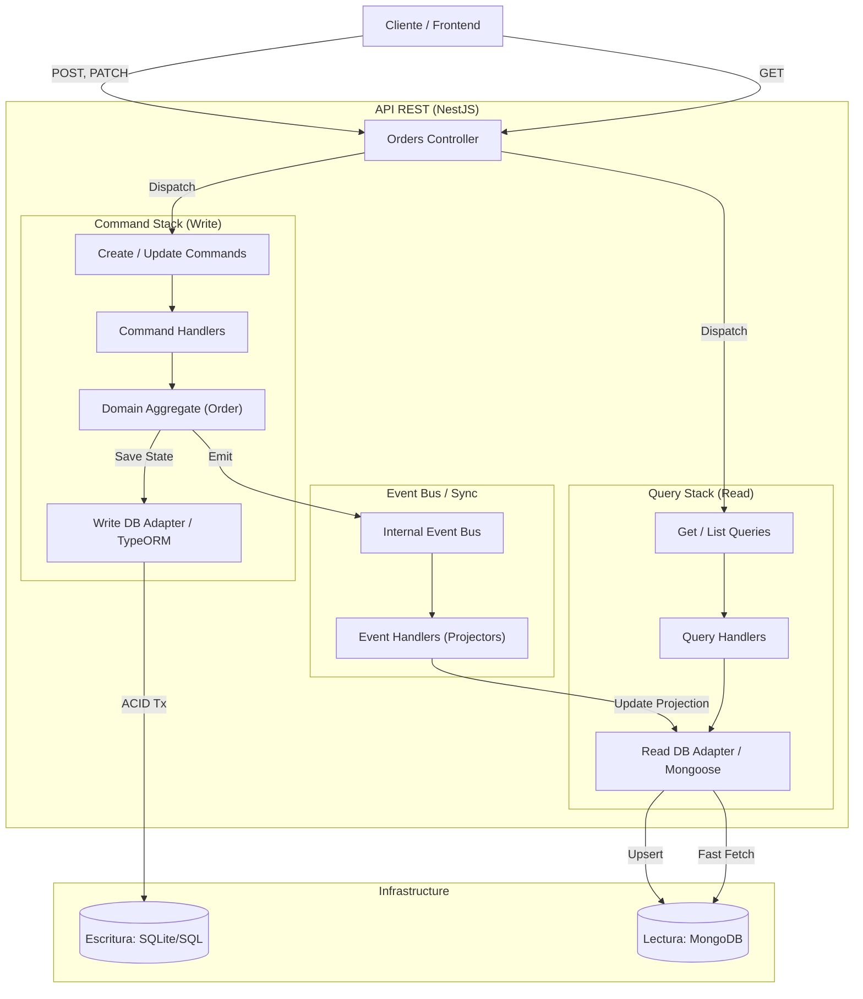

# CQRS Order Management System

## 1. Descripción del Problema
Una empresa de comercio electrónico en crecimiento presentaba severos problemas de rendimiento, bloqueos y latencia en su módulo de gestión de pedidos durante campañas promocionales y temporadas de alta demanda. El problema raíz radicaba en que la aplicación utilizaba un **único modelo de datos** (y una sola base de datos relacional) para manejar simultáneamente:
- **Alta carga transaccional (Escrituras)**: Registro masivo de nuevos pedidos, carritos y actualizaciones continuas de estados.
- **Alta carga analítica (Lecturas)**: Consultas masivas por parte de usuarios revisando el estado de sus pedidos, sumado a complejos cálculos del área administrativa para obtener reportes y resúmenes de ventas (joins pesados).

Esta competencia por el acceso y bloqueo de las mismas tablas generaba cuellos de botella significativos.

---

## 2. Explicación de la Arquitectura Propuesta
Para resolver el cuello de botella, se implementó el patrón **CQRS (Command Query Responsibility Segregation)**, apoyado sobre **Onion Architecture / Arquitectura Hexagonal**. 

La arquitectura separa estrictamente el sistema en dos líneas de procesamiento encapsuladas:
- **Write Side (Comandos)**: Define un modelo de dominio puro regido por entidades rígidas (Aggregate Roots). Se encarga de validar reglas de negocio ("no se puede añadir un producto a un pedido enviado") y proteger la consistencia ACID.
- **Read Side (Consultas)**: Define un modelo desnormalizado y optimizado exclusivamente para iteraciones y vistas rápidas, sin lidiar con relaciones complejas o reglas de negocio restrictivas.

---

## 3. Diagrama de Contenedores y Componentes

---

## 4. Descripción de Comandos y Consultas

### Comandos (Escritura que muta el estado)
- `CreateOrderCommand`: Inicia el ciclo de vida del pedido con productos y estado `Created`.
- `ChangeOrderStateCommand`: Cambia estados predefinidos validando la máquina de estados actual (`Paid`, `Shipped`, etc).
- `AddProductCommand`: Añade un producto al carrito verificando que el pedido no fue despachado.
- `RemoveProductCommand`: Elimina un producto bajo las mismas restricciones lógicas.

### Consultas (Lectura que no altera datos)
- `GetOrderQuery`: Retorna el documento plano de un pedido específico.
- `ListCustomerOrdersQuery`: Devuelve la lista instantánea de órdenes de un cliente.
- `ListOrdersByStateQuery`: Filtra las compras basadas en su estado transaccional.
- `GetSalesSummaryQuery`: Aprovecha funciones nativas de la capa de lectura (Aggregation Pipeline) para calcular al vuelo productos más vendidos, sumatoria en dinero y totales sin usar sentencias complejas de SQL.

---

## 5. Sincronización del Modelo de Lectura
La sincronización ocurre de forma reactiva y asíncrona (Event-Driven):
1. Cuando un `CommandHandler` persiste la data en la base de datos de escritura, el Agregado de Dominio (Aggregate Root) hace `commit()` de los eventos acumulados y dispara eventos del dominio como `OrderCreatedEvent` u `OrderStateChangedEvent`.
2. El Bus de Eventos captura estas señales y las envía inmediatamente a un `EventHandler` de infraestructura (proyector).
3. El `EventHandler` mapea dichos datos puros y actualiza la base de datos de lectura con una versión **"Aplanada"** y orientada al consumidor. La sincronización implementada en el prototipo es de Eventos en tiempo de ejecución (immediate / async memory bus).

---

## 6. Justificaciones de Diseño

### 6.1. ¿Por qué se eligieron esas dos bases de datos?
- **Escritura (Relacional - TypeORM / SQLite / Postgres)**: El control transaccional relacional es innegociable cuando hablamos de ventas, reducción de inventario, y finanzas. La base ACID de una base SQL asegura consistencia, y en nuestra capa `Write` necesitamos evitar dobles pagos o anomalías. 
- **Lectura (NoSQL - Mongoose / MongoDB)**: Al ser orientada a documentos, permite recuperar la orden de compra íntegra en 1 solo un viaje de red en esquema JSON, sin necesidad de unir 4 o 5 tablas `JOIN`. Además, para resolver consultas gerenciales pesadas de las áreas administrativas (`sales-summary`), el pipeline de agregación de MongoDB es extraordinariamente rápido.

### 6.2. ¿Cómo CQRS contribuye al desempeño del sistema?
A medida que la empresa crece y los picos de uso se presentan, CQRS nos permite hacer escalado asimétrico. Las "Lecturas" suelen ser desproporcionadas sobre las "Escrituras" (ej. 10 a 1). Gracias a esta separación, la base de datos SQL no colapsará resolviendo reportes, porque todas las consultas pegarán puramente a la caché/tabla aplanada del clúster de MongoDB sin afectar los carritos de compras activos.

### 6.3. Beneficios Técnicos
1. **Desempeño Extremo**: Consultas pre-empacadas y rápidas en el modelo de lectura.
2. **Escalabilidad Independiente**: Se pueden crear 5 replicas de la Base Read DB, y solo 1 o 2 de la Write DB.
3. **Mantenibilidad Completa**: La lógica de negocio rigurosa no se mezcla con consultas genéricas o DTOs sucios del cliente.

### 6.4. Limitaciones y Trade-Offs (Desventajas)
1. **Consistencia Eventual**: A diferencia de los sistemas tradicionales, un cliente puede enviar una compra y durante microsegundos (o si los eventos se encolan, minutos), la base de lectura devolva un resultado anterior hasta que el sumidero de eventos sincronice los dos motores.
2. **Complejidad de Infraestructura**: Duplicar motores y establecer buses de datos duplica los costos de servidores, operaciones y los puntos de fallo. Exige monitoreos y tolerancias a eventos perdidos (event replay features).

---
## 7. Instrucciones de Ejecución Local
* Dependencias requeridas: NodeJS v18+ y NPM
* Clonar repositorio y lanzar `npm install`
* Inicializar el backend `npx nx serve orders` (Las bases de datos empleadas en el código simulan la infraestructura creando las mismas conexiones internamente sobre la memoria operativa para facilitar ejecución sin requerimientos extra).
* Correr pruebas de integración: `npx nx e2e orders-e2e`
